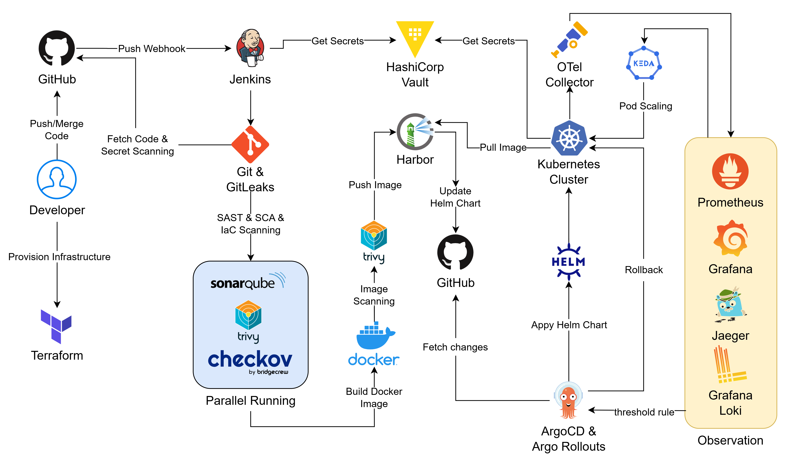

# Đồ Án DevSecOps triển khai Microservice trên GKE

## Table of contents

1. [Cấu Trúc Repo](#cấu-trúc-repo)
2. [Architecture of DevSecOps Pipeline](#architecture-of-devsecops-pipeline)
3. [Tech Stack](#tech-stack)
4. [Pipeline Workflow](#pipeline-workflow)
5. [Các kịch bản Demo](#các-kịch-bản-demo)
6. [Task List](#task-list)
7. [Nhóm 1 – Triển Khai Hạ Tầng với Terraform](#nhóm-1--triển-khai-hạ-tầng-với-terraform)
8. [Nhóm 2 – Triển Khai CI Pipeline (Jenkins + Security Scanning)](#nhóm-2--triển-khai-ci-pipeline-jenkins--security-scanning)
9. [Nhóm 3 – Triển Khai CD Pipeline (ArgoCD, Argo Rollouts & Microservice)](#nhóm-3--triển-khai-cd-pipeline-argocd-argo-rollouts--microservice)
10. [Nhóm 4 – Triển Khai Observation Stack](#nhóm-4--triển-khai-observation-stack)
11. [Nhóm 5 – Các Thành Phần Khác](#nhóm-5--các-thành-phần-khác)
12. [Phụ Lục – Thứ Tự Triển Khai Khuyến Nghị](#phụ-lục--thứ-tự-triển-khai-khuyến-nghị)

---

## Cấu Trúc Repo

```
devsecops-project/
├── app_scr/
├── terraform/
│   ├── modules/
│   │   ├── networking/
│   │   ├── gke/
│   │   ├── k8s-bootstrap/
│   │   └── iam/
│   ├── main.tf
│   ├── variables.tf
│   ├── outputs.tf
│   ├── providers.tf
│   └── terraform.tfvars
├── helm-chart/
│   ├── microservices/
│   │   ├── frontend/
│   │   ├── cartservice/
│   │   └── ... (10-12 other services)
│   ├── ingress-nginx/
│   │   ├── values.yaml
│   │   └── ingress.yaml
│   ├── cert-manager/
│   │   ├── cluster_issuer.yaml
│   │   └── values.yaml
│   ├── sonarqube/
│   │   └── values.yaml
│   ├── jenkins/
│   │   ├── values.yaml
│   │   └── rbac.yaml
│   ├── node_affinity_toleration_templates.yaml
│   └── ...
├── jenkins/
│   ├── Jenkinsfile
│   └── pod-templates/
├── demo-scripts/
│   ├── scenario1-checklist.md
│   ├── scenario2-k6.js
│   ├── scenario2-watch.sh
│   ├── scenario2-checklist.md
│   ├── scenario2-expected-results.md
│   └── scenario3-security-sim.sh
├── README.md
├── .gitignore
├── NOTE.md
├── setup.sh
├── .gitleaks.toml
└── sonar-project.properties
```

---

## Architecture of DevSecOps Pipeline



---

## Tech Stack

| **Chức năng / Nhiệm vụ**                | **Tool**                    |
| --------------------------------------- | --------------------------- |
| **Môi trường cloud**                    | Google Cloud Platform (GCP) |
| **Quản lý source code**                 | GitHub                      |
| **Provisioning hạ tầng (IaC)**          | Terraform                   |
| **CI — điều phối pipeline**             | Jenkins                     |
| **Quản lý secret tập trung**            | HashiCorp Vault             |
| **Quét secret bị lộ trong lịch sử Git** | Gitleaks                    |
| **SAST — phân tích code tĩnh**          | SonarQube                   |
| **SCA — quét dependency + Image**       | Trivy                       |
| **IaC scanning — kiểm tra Terraform**   | Checkov                     |
| **Build container image**               | Docker                      |
| **Image registry**                      | Harbor                      |
| **CD — GitOps sync & deploy**           | ArgoCD                      |
| **Rollout strategy + Rollback**         | Argo Rollouts               |
| **Package manifest K8s**                | Helm Chart                  |
| **Event-driven autoscaling**            | KEDA                        |
| **Thu thập telemetry tập trung**        | OpenTelemetry Collector     |
| **Metrics**                             | Prometheus                  |
| **Logging**                             | Loki                        |
| **Distributed tracing**                 | Jaeger                      |
| **Dashboard & alerting**                | Grafana                     |
| **Orchestration**                       | Kubernetes (GKE)            |

---

## Pipeline Workflow

**Step 1:** Developer push / merge Pull Request trên GitHub.

**Step 2:** GitHub gửi webhook tới Jenkins à tạo trigger Jenkins thực hiện các stage sau:

- **Stage 1:** Jenkins thực hiện tuần tự các bước sau:

	- Git checkout (dùng Git kéo các thay đổi từ GitHub về)
	- GitLeaks: Secret scan (scan toàn bộ lịch sử Git để phát hiện có secret nào bị lộ không)

- **Stage 2:** Jenkins thực hiện song song các bước sau:

	- Sonarqube: SAST (phân tích code)
	- Trivy: SCA (quét dependency, thư viện được sử dụng)
	- Checkov: IaC scan (quét các Terraform files)

- **Stage 3:** Jenkins thực hiện tuần tự các bước sau:

	- Docker: build image
	- Trivy: Image scan

- **Stage 4:** Jenkins thực hiện song song các bước sau:

	- Harbor: push image sau khi scan lên Harbor registry
	- Update image tag của Helm Chart trong GitHub repo

**Step 3:** ArgoCD phát hiện có sự thay đổi trong GitHub repo à Gọi Helm Chart để render manifest sau đó apply manifest vào K8s.

**Step 4**: ArgoCD Rollouts áp dụng Canary rollout (từ 10% à 50% à 100%) tùy thuộc vào success rate lấy từ metric của prometheus.

**Step 5**: OTel Collector thu thập metric / log / trace của các node worker bên trong K8s Cluster và push về các exporter (Prometheus, Loki, Jaeger)

**Step 6**: Grafana dashboard + Alertmanager

- Alert threshold à KEDA autoscale Pod
- Alert error rate/security issues à Argo Rollouts rollback

---

## Các kịch bản Demo

### Kịch bản 1: Baseline

**Mục đích:** Chứng minh toàn bộ pipeline hoạt động end-to-end, tất cả tool liên kết đúng.

**Luồng demo:**

1. Developer push code lên GitHub branch main
2. Jenkins trigger: build image → 5 scan song song → pass quality gate → sign → push Harbor
3. ArgoCD tự động sync → Helm deploy → Argo Rollouts canary 10% → 100%
4. Trên Grafana: hiển thị metrics (request rate, latency, error rate), logs (Loki), traces (Jaeger)

**Kết quả cần thấy được:**

- Jenkins pipeline green, tất cả stage pass
- ArgoCD UI: application synced + healthy
- Grafana dashboard: RED metrics hiển thị bình thường

---

### Kịch bản 2: Pod scaling tự động với KEDA

**Mục đích:** Chứng minh hệ thống tự scale khi tải tăng, dựa trên metric thực từ Prometheus.

**Luồng demo:**

1. Dùng công cụ load test (k6 / Locust) tăng traffic đột ngột vào app
2. Prometheus thu thập metric: http_requests_per_second vượt ngưỡng (VD: > 100 rps)
3. Grafana AlertManager phát alert HighRequestRate
4. KEDA ScaledObject (trigger = Prometheus query) phát hiện metric vượt threshold
5. KEDA tự động tăng replica: 2 Pod → 6 Pod (HPA do KEDA quản lý)
6. Grafana dashboard: quan sát số replica tăng, latency giảm trở lại bình thường
7. Load test kết thúc → metric giảm → KEDA scale down về replica tối thiểu

**Kết quả cần thấy được:**

- Grafana: biểu đồ replica count tăng/giảm theo traffic
- Grafana: latency spike rồi giảm khi thêm Pod
- K8s: kubectl get pods thấy số Pod thay đổi real-time

---

### Kịch bản 3: Phát hiện sự cố bảo mật → Argo Rollouts rollback

**Mục đích:**

**Falco phát hiện runtime threat:**

1. Deploy một version app có hành vi bất thường (VD: spawn shell, đọc file /etc/shadow)
2. Falco DaemonSet phát hiện syscall vi phạm rule → fire alert qua Falcosidekick
3. Falcosidekick gửi event đến: Slack (notify), Prometheus (metric falco_events_total)
4. Grafana alert rule SecurityEventCritical trigger → webhook call Argo Rollouts
5. Argo Rollouts rollback về revision trước đó (image SHA cũ)
6. Kyverno optional: thêm NetworkPolicy isolate Pod bị ảnh hưởng

**OWASP ZAP phát hiện vulnerability:**

1. Deploy version app có lỗ hổng (VD: endpoint không có auth, SQL injection)
2. OWASP ZAP DAST scan phát hiện High severity finding
3. Jenkins DAST gate: fail → block promote lên production
4. Argo Rollouts giữ nguyên production ở version cũ (không có gì để rollback vì prod chưa đổi)
5. DefectDojo nhận finding, tạo ticket để developer fix

**Kết quả cần thấy được:**

- Grafana: alert hiển thị security event
- Argo Rollouts UI: rollback thành công, revision giảm về version trước
- Lệnh kubectl get pods: Pod mới chạy image SHA cũ

---

## Task List

| Task | Tên                                                 | Nhóm   |
| ---- | --------------------------------------------------- | ------ |
| 1.1  | Terraform: Networking & GCP Foundation              | Nhóm 1 |
| 1.2  | Terraform: GKE Cluster & Node Pools                 | Nhóm 1 |
| 1.3  | Terraform: Namespaces, Helm Provider & Bootstrap    | Nhóm 1 |
| 2.1  | Jenkins Controller + Dynamic Agent trên GKE         | Nhóm 2 |
| 2.2  | Gitleaks + SonarQube tích hợp Jenkins               | Nhóm 2 |
| 2.3  | Trivy + Checkov tích hợp Jenkins                    | Nhóm 2 |
| 2.4  | Jenkinsfile End-to-End: Build, Push, Trigger ArgoCD | Nhóm 2 |
| 3.1  | ArgoCD + Argo Rollouts & GitOps Repo                | Nhóm 3 |
| 3.2  | Helm Chart & Cấu hình Microservice Online Boutique  | Nhóm 3 |
| 3.3  | Argo Rollouts Canary                                | Nhóm 3 |
| 4.1  | Prometheus + Grafana + Alerting                     | Nhóm 4 |
| 4.2  | Loki + Jaeger + OTel Collector                      | Nhóm 4 |
| 5.1  | HashiCorp Vault & Secret Management                 | Nhóm 5 |
| 5.2  | Harbor Image Registry                               | Nhóm 5 |
| 5.3  | KEDA Autoscaling & Demo Scenarios                   | Nhóm 5 |

---

## Nhóm 1 – Triển Khai Hạ Tầng với Terraform

> **Mục tiêu:** Dựng toàn bộ hạ tầng GCP bằng Terraform chia thành các module độc lập, có state backend trên GCS, tất cả tài nguyên được tag và phân tách namespace đúng node pool.

---

### TASK 1.1 – Terraform Module: Networking & GCP Foundation

#### Mô tả 

- Khởi tạo Terraform project với cấu trúc thư mục module rõ ràng.
- Viết module `networking` bao gồm: tạo VPC, subnet (với secondary ranges cho GKE pods & services), Cloud NAT, Cloud Router. 
- Cấu hình GCS bucket làm remote backend cho Terraform state. 
- Cấu hình IAM Service Account với các role cần thiết cho GKE, Terraform, và workload identity. 
- Thiết lập biến đầu vào (`variables.tf`) và output (`outputs.tf`) chuẩn để các module khác tham chiếu.

#### Keywords 

VPC, subnet, secondary IP ranges, Cloud NAT, Cloud Router, GCS backend, Service Account, Workload Identity, IAM roles, `terraform init`, `terraform workspace`

#### Kết quả cần đạt

- Thư mục project Terraform với cấu trúc module đầy đủ
- Module `networking` hoạt động: `terraform plan/apply` tạo được VPC, subnet, NAT thành công
- GCS bucket lưu state, không còn state local
- File `outputs.tf` export đủ `vpc_id`, `subnet_id`, `service_account_email` để các module sau dùng

#### Bổ sung thông tin cho phần Bootstrap Step (Bước chuẩn bị trước khi chạy Terraform)
Để giải quyết bài toán là "Terraform cần GCS bucket để lưu file state, nhưng nếu dùng Terraform tạo bucket thì state của quá trình tạo đó sẽ lưu ở đâu?", nên là cần thực hiện tạo GCS Bucket thủ công bằng lệnh `gcloud` trước khi chạy Terraform.

Mở GCP Cloud Shell hoặc Terminal có cài đặt Google Cloud SDK và chạy các lệnh sau:

```bash
# 1. Lấy tự động Project ID
export PROJECT_ID=$(gcloud config get-value project)

# 2. Đặt tên bucket (gắn kèm project ID để đảm bảo tính duy nhất)
export BUCKET_NAME="devsecops-tfstate-$PROJECT_ID"
export REGION="us-central1" # Hoặc asia-southeast1 tùy cấu hình

# 3. Tạo bucket
gcloud storage buckets create gs://$BUCKET_NAME --project=$PROJECT_ID --location=$REGION

# 4. Bật tính năng Versioning cho bucket (Bắt buộc để an toàn state)
gcloud storage buckets update gs://$BUCKET_NAME --versioning

# 5. Lấy tên bucket để điền vào providers.tf
echo "Điền tên bucket này vào providers.tf: $BUCKET_NAME"

```

Các lệnh trên đã được chạy và tạo thành công GCS Bucket!

#### Bổ sung thông tin về các Workspace đã được tạo
Đã thực hiện tạo 3 Workspace là dev, staging và prod. 

Dùng câu lệnh bên dưới để kiểm tra danh sách các workspace đang có: 
```bash
terraform workspace list
```
Dùng câu lệnh bên dưới để chọn workspace làm việc:
```bash
terraform workspace select <ten_workspace>
```

---

### TASK 1.2 – Terraform Module: GKE Cluster & Node Pools

#### Mô tả 

Viết module `gke` để tạo GKE cluster (private cluster, release channel STABLE). Định nghĩa 3 node pool với đúng cấu hình:

- `platform-pool`: 2 node `e2-standard-2`, taint/label `pool=platform`
- `observation-pool`: 2 node `e2-standard-2`, taint/label `pool=observation`
- `app-pool`: autoscaling min=1 max=2 node `e2-standard-2`, taint/label `pool=app`

Cấu hình cluster addons: Workload Identity, GCS Fuse CSI, các addon cần thiết. Cấu hình `kubeconfig` output. Cài đặt các network policy và cấu hình logging/monitoring cơ bản của GKE.

#### Keywords 

GKE private cluster, node pool, taint, label, autoscaling, Workload Identity, `e2-standard-2`, `e2-medium`, kubeconfig, cluster addons, node pool upgrade strategy

#### Kết quả cần đạt

- GKE cluster 3 node pool tạo thành công trên GCP Console
- `kubectl get nodes --show-labels` hiển thị đúng label và số lượng node từng pool
- `kubeconfig` kết nối được cluster từ máy local
- `terraform destroy` dọn sạch không còn tài nguyên thừa

---

### TASK 1.3 – Terraform Module: Namespaces, Helm Provider & Cấu Hình Ban Đầu Cluster

#### Mô tả 

- Viết module `k8s-bootstrap` sử dụng Terraform Kubernetes provider và Helm provider. 
- Tạo toàn bộ namespace cho từng tool: `jenkins`, `sonarqube`, `argocd`, `argo-rollouts`, `vault`, `harbor`, `defectdojo`, `monitoring`, `logging`, `tracing`, `security`, `app`. 
- Cài đặt cert-manager qua Helm (cần thiết cho nhiều tool sau). 
- Cài đặt ingress-nginx controller và cấu hình IngressClass. 
- Tạo các `ResourceQuota` và `LimitRange` theo từng namespace phù hợp với node pool. 
- Viết `NodeAffinity` và `Toleration` template chuẩn để dùng lại cho các module sau.

#### Keywords 

Terraform Helm provider, Kubernetes provider, namespace, cert-manager, ingress-nginx, IngressClass, ResourceQuota, LimitRange, NodeAffinity, Toleration, Helm release

#### Kết quả cần đạt

- `kubectl get ns` liệt kê đầy đủ namespace theo thiết kế
- cert-manager pods running trong namespace riêng
- Ingress controller hoạt động, test được `404 from nginx` qua external IP
- File `node_affinity_templates.yaml` làm tài liệu chuẩn cho nhóm

---

## Nhóm 2 – Triển Khai CI Pipeline (Jenkins + Security Scanning)

> **Mục tiêu:** Jenkins chạy mô hình dynamic agent trên K8s, pipeline end-to-end từ checkout code đến push image, tích hợp đầy đủ các security tool và gửi kết quả về DefectDojo.

---

### TASK 2.1 – Triển Khai Jenkins Controller + Dynamic Agent trên GKE

#### Mô tả 

- Cài đặt Jenkins Controller trên `platform-pool` qua Helm chart (`jenkins/jenkins`). 
- Cấu hình Jenkins Kubernetes Plugin để tạo dynamic pod agent trong cùng namespace khi có job chạy, xóa pod sau khi job kết thúc. 
- Định nghĩa Pod Template với các container: `jnlp` (agent base), `docker` (Docker-in-Docker hoặc sidecar), `kubectl`, `helm`. 
- Cấu hình NodeAffinity đảm bảo controller và agent pod chạy trong `platform-pool`. 
- Cài đặt Jenkins qua HTTPS với cert-manager. 
- Cấu hình Jenkins RBAC (ServiceAccount, ClusterRoleBinding) để agent có thể tương tác với K8s API.

#### Keywords 

Jenkins Helm chart, Kubernetes Plugin, dynamic pod agent, JNLP, Pod Template, DinD (Docker-in-Docker), NodeAffinity `platform-pool`, Jenkins RBAC, ServiceAccount, PVC cho Jenkins home, casc (Configuration as Code)

#### Kết quả cần đạt

- Jenkins UI truy cập được qua Ingress/HTTPS
- Tạo một pipeline test đơn giản, xác nhận agent pod được tạo động trên `platform-pool`, chạy xong job thì pod tự xóa
- `kubectl get pods -n jenkins` trong lúc job chạy thấy agent pod, sau khi xong thì không còn
- Jenkins controller persistent data không mất sau khi restart

---

### TASK 2.2 – Tích Hợp Gitleaks (Secret Scanning) & SonarQube (SAST) vào Pipeline

#### Mô tả 

**Gitleaks:** 

- Thêm container `gitleaks` vào Pod Template của Jenkins agent. 
- Viết Jenkinsfile stage `Secret Scanning` chạy `gitleaks detect` trên source code checkout, cấu hình `.gitleaks.toml` custom rules nếu cần, xử lý kết quả (fail build nếu phát hiện secret, generate report JSON).

**SonarQube:** 

- Cài SonarQube Community Edition trên `platform-pool` qua Helm chart (`sonarqube/sonarqube`). 
- Cấu hình PVC cho data. 
- Tạo project trong SonarQube, lấy token. 
- Thêm container `sonar-scanner` vào Pod Template. 
- Viết stage `SAST - SonarQube` trong Jenkinsfile, cấu hình `sonar-project.properties`. 
- Cài SonarQube Quality Gate webhook để Jenkins đợi kết quả pass/fail. 

#### Keywords 

Gitleaks, `.gitleaks.toml`, secret scanning report, SonarQube Helm chart, sonar-scanner, Quality Gate, `sonar-project.properties`, SonarQube webhook, Jenkins credentials store

#### Kết quả cần đạt

- SonarQube UI truy cập được, project được tạo và scan thành công
- Stage Gitleaks trong Jenkinsfile: chạy được, fail khi có secret hardcode test, pass khi clean
- Stage SonarQube: report hiện trên SonarQube dashboard, Quality Gate trả kết quả về Jenkins

---

**📌 Hướng dẫn truy cập UI SonarQube (Dành cho thành viên nhóm)**

Do ở giai đoạn này SonarQube đang chạy bảo mật bên trong mạng nội bộ của K8s (chưa public Ingress), các thành viên cần dùng lệnh `port-forward` để truy cập:

**Bước 1:** Đảm bảo máy cá nhân đã dùng lệnh `gcloud` để kết nối tới đúng Cluster của đồ án.

**Bước 2:** Mở Terminal/CMD và chạy lệnh sau để mở đường hầm:
```bash
kubectl port-forward svc/sonarqube-release-sonarqube 9000:9000 -n sonarqube
```
(Lưu ý: Giữ nguyên cửa sổ Terminal này trong suốt quá trình xem)

**Bước 3:** Mở trình duyệt web và truy cập: http://localhost:9000

**Bước 4:** Đăng nhập với thông tin Username và Password được cung cấp

---

### TASK 2.3 – Tích Hợp Trivy (SCA & Image Scan) + Checkov (IaC Scan) vào Pipeline

#### Mô tả 

**Trivy:** Thêm container `trivy` vào Pod Template. Viết 2 stage trong Jenkinsfile:

- `SCA - Dependency Scan`: `trivy fs` scan thư mục source code, output JSON/table
- `Image Scan`: sau khi build Docker image, chạy `trivy image` scan image vừa build, cấu hình severity threshold (CRITICAL/HIGH fail build), export report. Đẩy kết quả lên DefectDojo.

**Checkov:** 

- Thêm container `checkov` vào Pod Template. 
- Viết stage `IaC Scan - Checkov` chạy `checkov -d ./terraform` scan toàn bộ Terraform code, cấu hình skip checks nếu cần, output JSON report.

#### Keywords 

Trivy fs scan, Trivy image scan, severity threshold, SARIF/JSON output, Checkov, `checkov -d`, skip-check, Trivy DB cache (PVC), Trivy ignorefile

#### Kết quả cần đạt

- Stage Trivy SCA: chạy được, phát hiện CVE trong dependencies, report JSON xuất ra artifact Jenkins
- Stage Trivy Image Scan: scan image sau build, fail build khi có CRITICAL CVE (test với image có lỗ hổng)
- Stage Checkov: report IaC scan

---

### TASK 2.4 – Jenkinsfile Pipeline End-to-End: Build, Push Image lên Harbor & Trigger ArgoCD

#### Mô tả 

Viết Jenkinsfile hoàn chỉnh tích hợp tất cả stage theo thứ tự chuẩn DevSecOps: `Checkout → Secret Scan → SAST → SCA → IaC Scan → Build Docker Image → Image Scan → Push to Harbor → Update Helm Values → Trigger ArgoCD Sync`

Cấu hình stage `Build & Push`: build Dockerfile cho microservice, tag image với Git commit SHA, đẩy lên Harbor registry (cấu hình credential trong Jenkins lấy từ Vault). Stage `Update Helm Values`: dùng `sed` hoặc `yq` cập nhật `values.yaml` với image tag mới rồi commit/push lên Git repo (GitOps pattern). Stage `Trigger ArgoCD`: gọi ArgoCD API hoặc dùng ArgoCD CLI để trigger sync. Cấu hình Webhook GitHub → Jenkins để tự động trigger pipeline khi có push.

#### Keywords 

Jenkinsfile declarative pipeline, multi-stage, Docker build, image tagging (git SHA), Harbor push, `docker login`, Harbor project/robot account, `yq`, GitOps image update, ArgoCD CLI sync, GitHub webhook, Jenkins shared library (nếu cần)

#### Kết quả cần đạt

- Jenkinsfile hoàn chỉnh trong repo, push code → pipeline tự động trigger
- Toàn bộ stage chạy end-to-end thành công (green pipeline)
- Image mới xuất hiện trên Harbor registry với đúng tag
- `values.yaml` được cập nhật tự động, ArgoCD nhận diện và sync
- Screenshot pipeline success làm bằng chứng demo Kịch bản 1

---

## Nhóm 3 – Triển Khai CD Pipeline (ArgoCD, Argo Rollouts & Microservice)

> **Mục tiêu:** GitOps CD hoàn chỉnh, Argo Rollouts thực hiện canary/blue-green deployment, microservice Google Online Boutique chạy trên `app-pool`.

---

### TASK 3.1 – Triển Khai ArgoCD + Argo Rollouts & Cấu Hình GitOps Repository

#### Mô tả 

- Cài ArgoCD trên `platform-pool` qua Helm chart (`argo/argo-cd`). 
- Cấu hình NodeAffinity đúng pool. 
- Thiết lập ArgoCD RBAC, cấu hình `argocd-cm` và `argocd-rbac-cm`. 
- Kết nối ArgoCD với GitHub repo (deploy key hoặc GitHub App). 
- Cấu hình ArgoCD App of Apps pattern: 1 root Application quản lý tất cả Application con. 
- Cài Argo Rollouts controller và Rollouts Dashboard trên `platform-pool`. 
- Cài `kubectl argo rollouts` plugin. 
- Cấu hình ArgoCD tích hợp với Argo Rollouts (annotations trên Application).

#### Keywords 

ArgoCD Helm chart, App of Apps, ArgoCD Application CRD, `argocd-cm`, `argocd-rbac-cm`, GitHub deploy key, Argo Rollouts controller, Rollouts Dashboard, `kubectl argo rollouts`, ArgoCD sync policy (automated/manual), self-heal, prune

#### Kết quả cần đạt

- ArgoCD UI truy cập được qua Ingress
- App of Apps cấu hình xong, thêm Application mới chỉ cần commit vào repo
- Argo Rollouts Dashboard truy cập được
- Test: tạo 1 Application đơn giản, sync thành công, `kubectl get applications -n argocd` hiển thị `Synced/Healthy`

---

### TASK 3.2 – Helm Chart & Cấu Hình Microservice (Google Online Boutique)

#### Mô tả 

- Fork/Clone repo [Google Online Boutique](https://github.com/GoogleCloudPlatform/microservices-demo) về GitHub của nhóm. 
- Với mỗi microservice, viết Helm chart riêng (hoặc dùng lại Helm Chart mà Repo cung cấp sẵn và chỉnh sửa lại) bao gồm: `Deployment`/`Rollout` (Argo Rollouts CRD thay Deployment), `Service`, `ServiceAccount`, `HorizontalPodAutoscaler` (tích hợp KEDA sau), `ConfigMap`, `ServiceMonitor` (cho Prometheus scrape). 
- Cấu hình `NodeAffinity` và `Toleration` để pod chạy đúng `app-pool`. 
- Cấu hình `resources.requests/limits` hợp lý. 
- Cấu hình OTel environment variable (`OTEL_EXPORTER_OTLP_ENDPOINT`) cho từng service. 
- Đẩy Helm chart lên Harbor OCI registry hoặc lưu trong Git repo.

#### Keywords 

Helm chart, umbrella chart, Argo Rollouts `Rollout` CRD, canary strategy, `values.yaml`, NodeAffinity `app-pool`, `resources.requests/limits`, ServiceMonitor, OTel env vars, `OTEL_SERVICE_NAME`, Harbor OCI push, `helm package`, `helm push`

#### Kết quả cần đạt

- Helm chart cho toàn bộ microservice trong thư mục `helm/` của repo
- `helm template` generate ra YAML hợp lệ
- Deploy thủ công 1 service test: pod chạy đúng node `app-pool`, accessible qua Service
- ArgoCD Application trỏ vào chart này, sync thành công

---

### TASK 3.3 – Cấu Hình Argo Rollouts (Canary Deployment)

#### Mô tả 

**Argo Rollouts:** 

- Cấu hình `Rollout` resource với chiến lược canary (ví dụ: 20% → 50% → 100%, pause giữa các bước hoặc dùng Analysis). 
- Tạo `AnalysisTemplate` dùng Prometheus metric (ví dụ: error rate) để tự động promote/abort rollout. 
- Test rollback: deploy version lỗi → Rollout tự abort về phiên bản stable. 
- Demo: `kubectl argo rollouts get rollout <name> --watch`.

#### Keywords 

Argo Rollouts canary steps, `AnalysisTemplate`, Prometheus metrics analysis, promote/abort/rollback, `kubectl argo rollouts`.

#### Kết quả cần đạt

- Rollout canary hoạt động: push image mới → ArgoCD sync → Rollout chia traffic theo đúng tỉ lệ
- Rollback thành công khi AnalysisTemplate phát hiện lỗi (demo được với Kịch bản 3)
- `kubectl argo rollouts history <name>` hiển thị lịch sử các lần deploy

---

## Nhóm 4 – Triển Khai Observation Stack

> **Mục tiêu:** Thu thập đầy đủ metrics, logs, traces từ tất cả microservice và platform tools, dashboard Grafana hiển thị tổng quan, alert tích hợp.

---

### TASK 4.1 – Triển Khai Prometheus + Grafana + Alerting

#### Mô tả 

- Cài `kube-prometheus-stack` Helm chart trên `observation-pool` (bao gồm Prometheus Operator, Prometheus, Alertmanager, Grafana, Node Exporter, kube-state-metrics). 
- Cấu hình NodeAffinity và Toleration đúng `observation-pool`. 
- Cấu hình Prometheus scrape các `ServiceMonitor` từ namespace khác (`platform`, `app`). 
- Cấu hình Alertmanager rules cho Kịch bản 2 (high CPU, high RPS, pod OOMKilled). 
- Tạo/import Grafana dashboard: Kubernetes cluster overview, JVM metrics (nếu có), microservice RED metrics (Rate, Error, Duration). 
- Cấu hình Grafana datasource: Prometheus, Loki, Jaeger. 
- Cấu hình PVC cho Prometheus data retention.

#### Keywords 

kube-prometheus-stack, Prometheus Operator, ServiceMonitor, PodMonitor, AlertmanagerConfig, PrometheusRule, Grafana dashboard import, Grafana datasource, `kube-state-metrics`, Node Exporter, PVC, remote write (nếu cần), Alertmanager webhook

#### Kết quả cần đạt

- Grafana UI truy cập được, đăng nhập thành công
- Dashboard Kubernetes cluster overview hiện đủ node, pod, CPU/Memory metrics
- Ít nhất 1 PrometheusRule tạo alert (test fire alert thủ công bằng `kubectl exec` stress test)
- `kubectl get servicemonitors -A` thấy ServiceMonitor của các tool và microservice

---

### TASK 4.2 – Triển Khai Loki (Log) + Jaeger (Trace) + OTel Collector

#### Mô tả 

**Loki:** Cài Loki (mode: single binary hoặc simple scalable) và Promtail qua Helm trên `observation-pool`. Promtail chạy DaemonSet trên `app-pool` để scrape log container. Cấu hình Grafana datasource Loki, tạo dashboard log exploration.

**Jaeger:** Cài Jaeger (All-in-One hoặc với Cassandra/Elasticsearch backend) trên `observation-pool` qua Helm. Cấu hình Grafana datasource Jaeger cho trace correlation.

**OTel Collector:** Cài OpenTelemetry Collector Helm chart. Triển khai 2 mode:

- DaemonSet trên `app-pool`: thu thập metrics, logs, traces từ microservice, forward về Prometheus/Loki/Jaeger
- Deployment trên `observation-pool`: gateway/aggregator

Cấu hình `otelcol-config.yaml` với receivers (OTLP gRPC/HTTP), processors (batch, memory_limiter, resource), exporters (Prometheus remote write, Loki, Jaeger).

#### Keywords 

Loki Helm chart, Promtail DaemonSet, Loki LogQL, Jaeger Helm chart, OTel Collector DaemonSet, `otelcol-config.yaml`, OTLP receiver, Prometheus exporter, Loki exporter, Jaeger exporter, trace correlation, `OTEL_EXPORTER_OTLP_ENDPOINT`, W3C TraceContext

#### Kết quả cần đạt

- Grafana: logs từ microservice hiển thị trên Loki explorer (filter theo namespace, service name)
- Grafana: traces hiển thị từ Jaeger datasource, xem được span chi tiết của 1 request end-to-end
- OTel Collector pod running trên cả `app-pool` (DaemonSet) và `observation-pool`
- Verify trace correlation: từ log Grafana click sang trace Jaeger (correlate bằng traceID)

---

## Nhóm 5 – Các Thành Phần Khác

> **Mục tiêu:** Hoàn thiện các thành phần bảo mật và hỗ trợ: Vault (secret management), Harbor (registry), Kyverno (policy), Falco (runtime security), KEDA (autoscaling), DefectDojo (vulnerability management).

---

### TASK 5.1 – Triển Khai HashiCorp Vault & Secret Management

#### Mô tả 

- Cài HashiCorp Vault trên `observation-pool` qua Helm chart (`hashicorp/vault`) với mode Standalone (hoặc HA nếu cần). 
- Cấu hình `auto-unseal` dùng GCP KMS (Cloud KMS key ring & crypto key). 
- Khởi tạo Vault (`vault operator init`), lưu root token và recovery keys an toàn. 
- Enable Vault Kubernetes Auth Method: cấu hình để Jenkins agent pods và microservice pods có thể authenticate với Vault dùng ServiceAccount token. 
- Tạo Vault policies, roles. 
- Tạo secrets cần thiết: Harbor credentials, SonarQube token, GitHub token, các app secret. 
- Cài Vault Agent Injector (đã có trong Helm chart): cấu hình annotation trên Jenkins pod template để inject secret vào env var. 
- Cài External Secrets Operator (ESO) hoặc Vault Agent làm cầu nối Vault → K8s Secret cho ArgoCD và microservice.

#### Keywords 

Vault Helm chart, Vault Standalone, GCP KMS auto-unseal, `vault operator init`, Vault Kubernetes Auth, ServiceAccount token review, Vault policy, Vault role, Vault Agent Injector, annotation `vault.hashicorp.com/agent-inject`, External Secrets Operator, `VaultStaticSecret` CRD, `SecretStore`

#### Kết quả cần đạt

- Vault UI truy cập được, Vault status: `Initialized: true, Sealed: false`
- Auto-unseal bằng GCP KMS: restart Vault pod → tự unseal không cần manual
- Jenkins pipeline đọc được Harbor credential từ Vault (không hardcode trong Jenkinsfile)
- Microservice pod mount được secret từ Vault Agent Injector, `env | grep SECRET` hiển thị đúng giá trị

---

### TASK 5.2 – Triển Khai Harbor Image Registry 

#### Mô tả 

**Harbor:** 

- Cài Harbor trên `observation-pool` qua Helm chart (`harbor/harbor`). 
- Cấu hình HTTPS với cert-manager. 
- Tạo project `devsecops` trong Harbor. 
- Tạo robot account cho Jenkins push image và ArgoCD pull image. 
- Cấu hình Harbor Vulnerability Scanning tích hợp Trivy (built-in). 
- Cấu hình retention policy cho image. 
- Test push/pull image từ Jenkins và ArgoCD.

#### Keywords 

Harbor Helm chart, Harbor project, robot account, Harbor Trivy integration, image retention policy, Docker pull secret.

#### Kết quả cần đạt

- Harbor UI truy cập được, `docker login <harbor-url>` thành công
- Jenkins build push image lên Harbor, image xuất hiện trong project, kèm vulnerability report từ Trivy

---

### TASK 5.3 – Cấu Hình KEDA (Autoscaling) & Demo Scenarios

#### Mô tả 

**KEDA:** 

- Cài KEDA trên `platform-pool` qua Helm chart (`kedacore/keda`). 
- Viết `ScaledObject` cho microservice frontend (hoặc service có traffic cao nhất): trigger dựa trên Prometheus metric (ví dụ: `http_requests_per_second`). 
- Cấu hình min/max replica, cooldown period. 
- Test: chạy load test (dùng `k6` hoặc `hey` hoặc `locust`) → KEDA trigger scale up → load giảm → scale down.

**Demo Scenarios:** Chuẩn bị script và checklist cho 3 kịch bản demo:

- **Kịch bản 1:** Checklist end-to-end pipeline, link các UI cần mở, thứ tự demo
- **Kịch bản 2:** Script load test (k6), câu lệnh watch KEDA scaling, Prometheus alert firing screenshot guide
- **Kịch bản 3:** Script giả lập lỗi security (inject hardcoded secret vào code, dùng vulnerable image, exec vào pod), checklist kết quả cần thấy trên mỗi tool

#### Keywords 

KEDA Helm, `ScaledObject` CRD, `ScaledJob`, Prometheus scaler trigger, `pollingInterval`, `cooldownPeriod`, `minReplicaCount`, `maxReplicaCount`, k6 load test script, `hey`, Prometheus alert `FIRING`, KEDA `kubectl get hpa`.

#### Kết quả cần đạt

- `kubectl get scaledobjects -A` thấy ScaledObject cho microservice
- Kịch bản 2: load test → pod scale từ 2 lên 4+ → Grafana/Prometheus alert FIRING → load dừng → scale down → alert RESOLVED
- `kubectl get hpa -A` thấy KEDA-managed HPA với replica tăng giảm theo tải
- File `demo_scripts/` chứa đủ: script load test, checklist demo, expected output cho từng kịch bản
